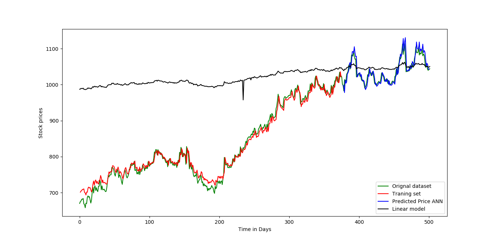

# Stock Market Price Predication

#### AUTHOR:

- [Chandramohan Jagtap](https://github.com/cmjagtap "Chandramohan's github profile")

#### DESCRIPTION:

  - Dataset:  
	The dataset is taken from NSE India's website in CSV format. The dataset consists of Open, High, Low and Closing Prices of 		Kotak bank Ltd. stocks from 29 March 2016 to 28 March 2018 - total 502 rows It's two year data. 

  - Data Pre-processing:  
	It is one column data(Closing price). This has been converted into two column time series data, 1st column consisting stock 		price of time t, and second column of time t+1. All values have been normalized between 0 and 1.

  - Model:   
	1) Two sequential LSTM(Long Short Term Memory) layers have been used together and one dense layer is used to build the ANN 		   model using Keras deep learning library. and 'linear' activation has been used as final layer.
	2) Linear Regression Model for predicting price 

  - Training and Testing data:  
	75% data is used for training. and 25% data used as Testing. 

#### Requirment  :
		1) python Pandas version `0.20.3` install using:- ' pip install pandas '
		2) python Matplotlib version `2.1.1` install :-	  ' pip install matploatlib '
		3) python Nupmy version `1.14.2` install using:-  ' pip install numpy '
		4) python Scikit learn lib `3.2.5` install:-      ' pip install sklearn '
		5) python Tensorflow lib  `1.5.0` install :-	  ' pip install tensorflow '
		6) python keras lib version `2.1.5` install:-	  ' pip install keras '
#### Test :  

  Normalized Mean square error is used for evaluating the prediction accuracy (NMSE).

#### Execution :  
	  ` python3 pricePrediction.py `

#### Conclusion :  

	I had used two models for predicting prices. so by comparision we found that both models  
	predict near about same prices but ANN model predicts better so It is better for prediction.  

Note:- Do not invest just by this project. do your own analysis.

	

